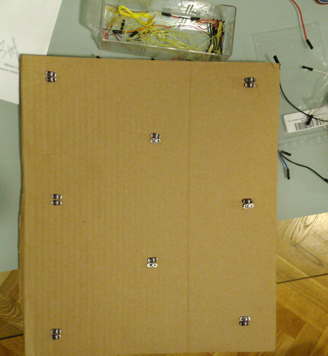
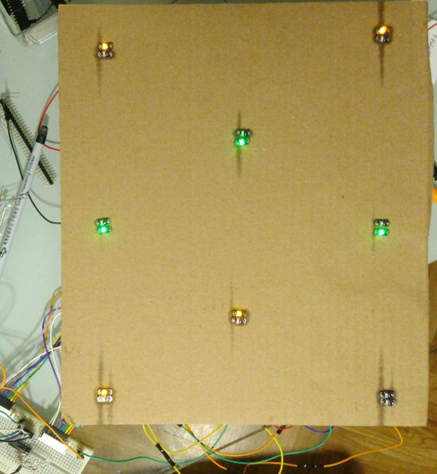

## Whack-a-mole with Q-learning on Arduino BLE 33 Sense [WIP]

### 0. Overview
This is an implementation of a classic [Whack-a-mole](https://en.wikipedia.org/wiki/Whac-A-Mole)  game with some twists. The objective is to build a simple robot (well, that's too much said) which can learn to play this game without being tols explicitly what the rules are. Even though the project was designed to run with Arduino BLE 33 Sense, there is also a command-line version that runs on a PC with a simulated camera.

In my implementation, the robot is the **agent**. It has a camera that constatly observes changes on the board (the **environment**). Depending on what it can see on the board, it decides which hole to hit (choose the next **state**).
#### The game and its modifications
The board in this implementation consists of 8 "holes" (this number can be modified). However, unlike in the classical game, the moles come in <b>two varieties</b>: *good moles* and *evil moles*. The objective is, of course, to whack only the evil species and keep the good ones unhurt. This idea was borrowed from a BSc dissertation called [Robot Learning through Crowd-Based Games](https://core.ac.uk/download/pdf/212992099.pdf) by Scott Cornman and Andy Wolff.

Building a robot that actually wields a toy hammer would be quite challenging and the mechanical side is not that relevant to demonstrate Q-learning. For this reason, instead of the actual board with holes, I have a board with 8 LEDs that light up as GREEN (if it's a good mole) or AMBER (if it's an evil mole). Here it is:

   

#### Wiring diagram

### 1. Implementation details
#### Main components
* *the agent* - defined in  [`whackamole_class.cpp`](src/whackamole_class.cpp) and its "eyes" in [`tf_camera.cpp`](src/tf_camera.cpp) (NOT IMPLEMENTED! just a stub, unfortunately). The agent can operate in two modes:
    * <b>learning</b> - in this mode you can make repeated calls to the `learn_step` method in order to build the Q-matrix of state/reward transitions. Note that you can save and load the Q-matrix using `serialize` and `deserialize` methods (so far implemented only for PC - for Arduino you should add a board-dependent implementation that can read from/write to your NVRAM or EEPROM)
    * <b>playing</b>  - in the playing mode you need to call the `play` method once on the current state of the environment

    In both modes, the agent acts (learns / plays) only when it detects a change in the environment. This is done by the agent waiting on a condition variable set by its "eyes", that is the camera. The camera takes pictures every 0.5 seconds, runs TensorFlow lite inference on the picture, writes the recognized state into the `OBSERVED_BOARD_STATE` global variable and finally notifies the agent (and possibly all other threads) about the change by setting the condition variable.
    
    After performing the whack, the agent writes the hole number to the `agent_whacked_hole` global atomic variable and notifies the board via condition variable. This notification simulates the physical contact between the hammer and the board in the real world.

* *the board (environment)* - defined in [`mole_board.cpp`](src/mole_board.cpp). The board contains current state and two core functions: `permute` - which randomly shows and hides the moles every 3 seconds if the agent is idle, and `whack` - which hides the moles chosen by the agent. Additionally, there are some functions for controlling the LEDs on Arduino. 

#### State representation
In this implementation there are **8 holes**. For each hole, there are three options: **0** - the hole is empty, **1** - there is a "good" mole (green LED on Arduino), **2** - there is a "bad" mole (amber LED on Arduino). Therefore, there are 3^8 = 6561 possible states of our environment. A number of the `unsigned short` type in the range between 0 and 6560 uniquely identifies the current state. If you convert this number to (an eight-digit) base-3, you will know how each hole looks like (most significant digit = hole 7 least significant digit = hole 0).
    
Example: state `6001` is `22020021` in base-3. The most significant digit is 2, so there is an evil mole in the seventh hole. The next most significant digit is also 2, so there is also an evil mole in hole number six. Hole number five is empty, because the next digit is 0. And so on until we reach the least significant digit, which is 1, so there is a good mole in the zeroeth hole.

The [`helpers.cpp`](src/helpers.cpp) file contains methods which convert between unsigned short int and array of `char` types (`to_base3_buf` and `base3_to_int`).

#### How the agent learns to play
At the beginning the agent knows absolutely nothing about the rules of the game. It just whacks the holes completely at random and receives a **reward** each time it hits an evil mole, or a **penalty** in case the hole was empty or contained a good mole. The agent can also choose not to hit any hole, in which case it's also penalized. Furthermore, the agent knows that it has reached a valid terminal state if either the board is empty, or it contains only good moles. It turns out that after random whacking for 50,000 games or so, the agent has learnt the rules!

You can modify the default values for rewards and penalties by changing the following #defines in [`include/mainwhack.hpp`](include/mainwhack.hpp):
    
* `REWARD` - reward for hitting an evil mole (default: `15`)
* `PENALTY` - penalty for hitting a good mole (default: `-50`)
* `MISS` - penalty for hitting an empty hole (default: `-10`)
* `IDLE_BUT_WRONG` - penalty for not hitting any hole (default: `-10`)

#### 2. Requirements
* **for PC simulator** - there are no dependencies, so any standard compiler which understands C++11 code should work. The only external library you may need is cppunit, but only if you want to run unit tests. 

* **for Arduino** - please install the board development kit for BLE 33 Sense in the IDE as explained [here](https://www.arduino.cc/en/Guide/NANO33BLESense).

#### 3. Building

Platform-dependent code is wrapped around the `#ifdef COMPILE_FOR_PC` ... `#endif` and  `#ifdef COMPILE_FOR_DUINO` ... `#endif` directives.

##### Configuration
The file [include/mainwhack.hpp](include/mainwhack.hpp) contains some useful constants you may want to experiment with:

* `NUM_HOLES` - well, the number of holes. Please note that the Arduino code is written for 16 LEDs in total and needs two shift registers. If you want to increase the number of holes, you will need more shift registers too.
* `BOARD_TICKER_INTERVAL` - number of seconds before the board cycles to a next random state if it is not hit by the agent (or if a manual reset was not requested explicitly)
* `MAX_HIT_ATTEMPTS` - maximal number of whacks the agent will perform to reach the terminal state before giving up. This applies **only for play mode** - in the training mode the agent will keep hitting forever until it reaches a valid terminal state.

In [include/whackrealtime.hpp](include/whackrealtime.hpp) there is also:

* `CAMERA_SCAN_INTERVAL` - number of milliseconds between camera captures. This is set to 1 on the simulator and can probably be 250 for many ArduCAM compatible devices. If you use OV7670 module with just bit-banging (no ArduCAM), you can forget about anything under 3000 to work properly.

##### For PC (simulator)
Just run `make` - this will build the executable in `bin/whack`.

##### For Arduino
We don't use the ARM gcc directly, but rather rely on the preconfigured compilation tools available in Arduino IDE. You will need to find a path to your installation and set the `ARDUINO_HOME` environment variable to point there. Just make sure you have a file called `arduino-builer` in that directory. On my Linux I do it like this:

	export ARDUINO_HOME=/wymiana/optified2/arduino-1.8.13-linux64/arduino-1.8.13/

In addition, you will need to make a small tweak to the compiler settings. Since Arduino lumps header and code files into the same directory by default, you need to tell its compiler to look for headers in the `include` directory. With my IDE this looks a little quirky, because instead of putting the hardware-related files for BLE 33 sense under `$ARDUINO_HOME/hardware` I found them under `$HOME/.arduino15/hardware`. Oh, well. Just copy the [`platform.local.txt`](platform.local.txt) file there and the include path should be added where needed.

Once these two adjustments are done, simply run `make duino` in the console. To flash the device, follow the instructions at the end of the compilation:

	*********************************************************************************
    * Completed compilation with arduino-build.                                     *
    *********************************************************************************
	Now you can flash the binary to your board using this command:
	sudo /home/hubert/.arduino15/packages/arduino/tools/bossac/1.9.1-arduino2/bossac -d --port=ttyACM0 -U -i -a -w ./duino_tmp/arduino_main.ino.bin -R

##### Running unit tests

Make sure your GCC compiler sees the `cppunit` headers in your system, then run `make test`.

##### Generating documentation

Use doxygen and the [`config.dox`](config.dox) file to generate documentation. This is still WIP.

#### 4. Running (PC simulator)

The `bin/whack` program runs in three threads which simulate the agent, the camera and the board. You can execute it in two modes:

##### Training
     $ ./bin/whack --train --num-episodes 50000 --serialize ./kret50k.bin

This will make the agent play 50,000 games during which it will hit the board completely randomly and build the Q-matrix. Go grab yourself some popcorn and observe the logs how they fly:

	=================== EPISODE 25487 ========================
	                                                                                            
	Attempting a forced reset.           (1)
	***** STEP 0 *****                   (2)
	Board permuted                       (3) 
	Done, board was manually reset to next state 470
	   Received from camera state 470, as base3: 2*0*1*2*2*1*0*0*   (4)
	   Next states 468*470*461*416*308*227*470*470*470*  (5)
	   Will hit hole 8 with a transition reward of -10. Agent thinks next state will be 470 and known Q-rewards from there are: 37*20*-20*37*37*-20*20*20*20* (6)
	   Therefore, the selected max is 37  (7a)
	   Q(470, 470) = -10 + 0.8*37 = 20 (7b)
    ***** STEP 1 *****
    ...

(1) - agent calls board and forces its reset.

(2) - the AGENT thread keeps running until it reaches the camera condition variable

(3) - the BOARD thread resets itself and enters a new state

(4) - the CAMERA thread notifies the AGENTS thread that the BOARD is now in a new state. Consequently, the AGENT thread resumes execution. Note that in this example the agent is in state 470, or 00122102. Since we adopt the convention that the least significant digit stands for zeroeth hole, it is convenient to reverse this encoding when printing to console, hence we print `...state 470, as base3: 2*0*1*2*2*1*0*0* ` to read holes from 0 to 7 from left to right. So: there is an evil mole in the zeroeth hole, the first hole is empty, the second hole has a good mole, the third has an evil creature, so does the fourth, in the the fifth there is a good mole, and holes six and seven are empty.

(5) Let's now assume the agent hits the zeroeth hole. This means that whatever digit was in the zeroeth position, it will become 0. So from `2*0*1*2*2*1*0*0*` we transition to `0*0*1*2*2*1*0*0*`, or 00122100 in unreversed base-3. This is 468 in decimal, and indeed that is what our log says. Hole 1 was empty, so hitting it means transition to the same state: 470 -> 470. Hitting hole 2 sets the digit in index 2 to zero: `2*0*1*2*2*1*0*0*` -> `2*0*0*2*2*1*0*0*`, 00122102 -> 00122002 in unreversed base-3, or 470 -> 461 in decimal. And so on. Notice that there are **eight** holes, but **nine** possible transitions. This is because the agent has an option not to hit anything and this option is explicitly encoded as the last possible state. It will always be equal to the initial state (470 in this case), but this allows you to set distinct penalties for "inactivity" and for hitting an empty hole.

(6) By random choice, the agent wants to hit hole 8 (= meaning: this is the ninth transition, or inactivity, as explained above). You can also see the current values of the Q-matrix for such a move into the same state.

(7a+b) This is the learning step. As described in the algorithm, the agent selects the maximum reward from the next state and, after some discounting (gamma = 0.8), adds it to the immediate penalty and updates the Q-matrix for the transition from state 470 to self.

After the training completes, you should see something like that:

	Q(486, 0) = 15 + 0.8*0 = 15
	***** STEP 12 *****
	Whacking hole 5
	Board was just whacked on hole 5 and went to state 0. Resetting the timer.
	   Received from camera state 0, as base3: 0*0*0*0*0*0*0*0*
	   This is the final state.
	Attempting a forced reset... Board permuted
	Done, board was manually reset to next state 2666
	Wrote the Q-array to ./kret50k.bin (1) 
	Exiting camera thread (2a)
	Board permuted
	Board cycling to the next state 2684
	Exiting board thread (2b)

(1) - The Q-matrix is serialized to this file. At the same time the AGENT thread set the global variable `supporting_threads_active` to `false`.
(2a+2b) Both the CAMERA and the BOARD threads run in a while loop until `supporting_threads_active` is `true`, so they can now safely destroy their resources, stop executing and join the main thread.

* playing

####5. Todo